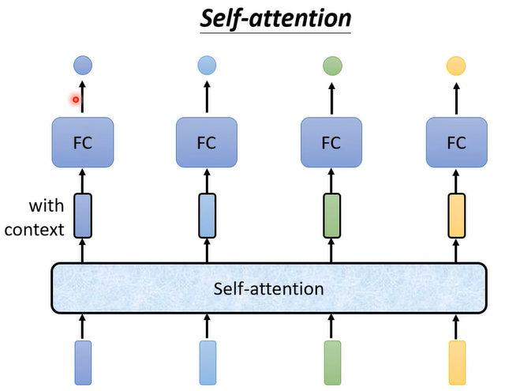
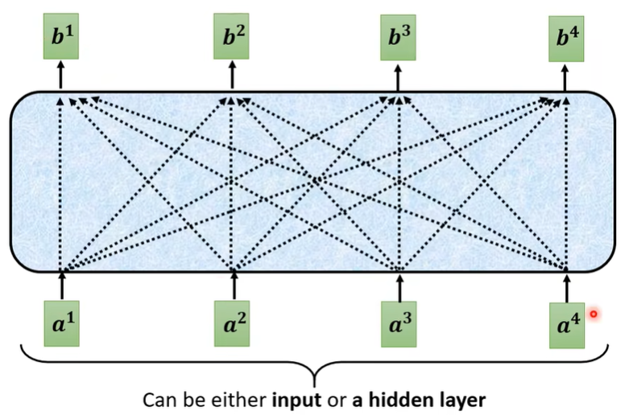
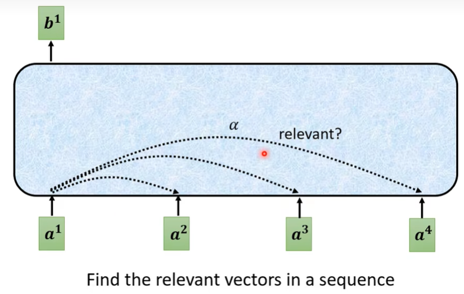
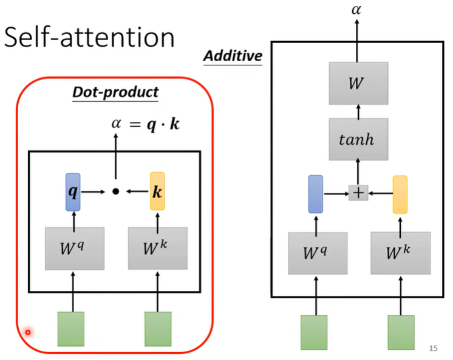
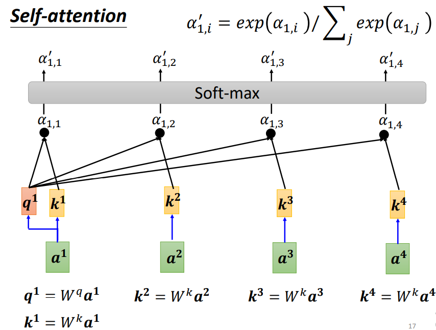
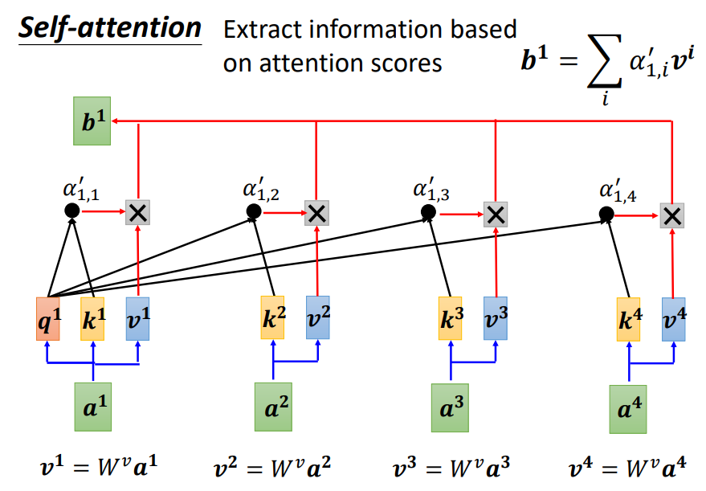
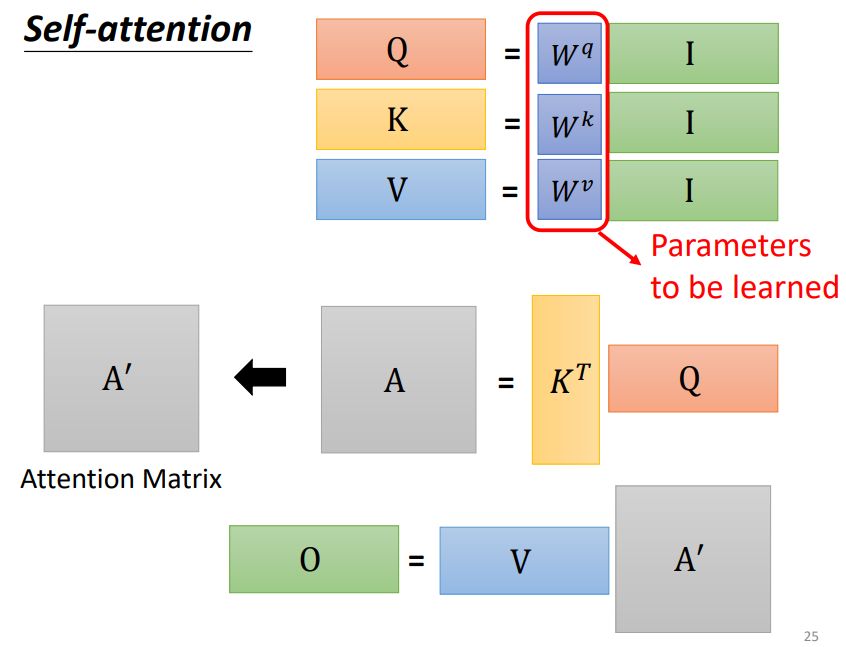
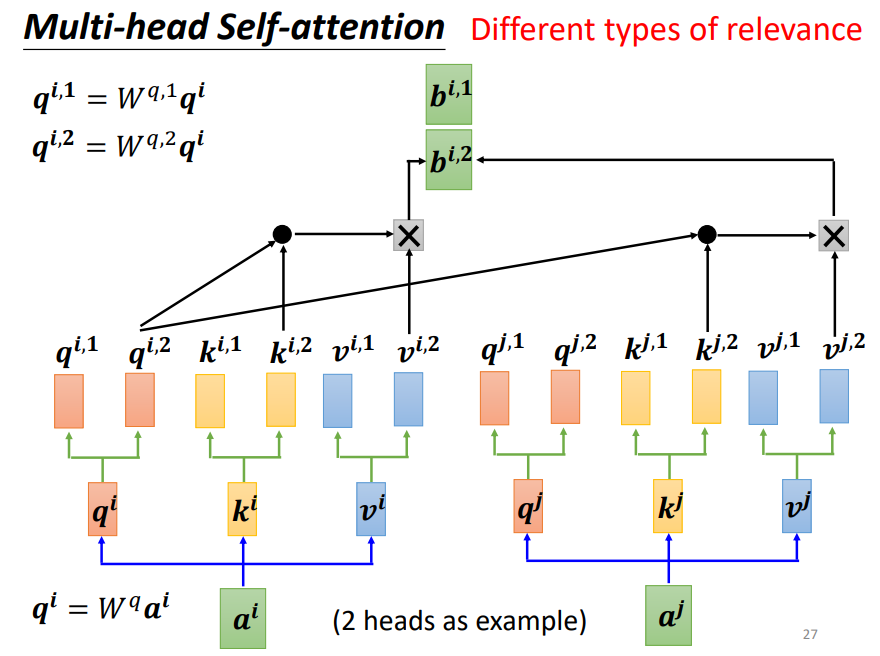
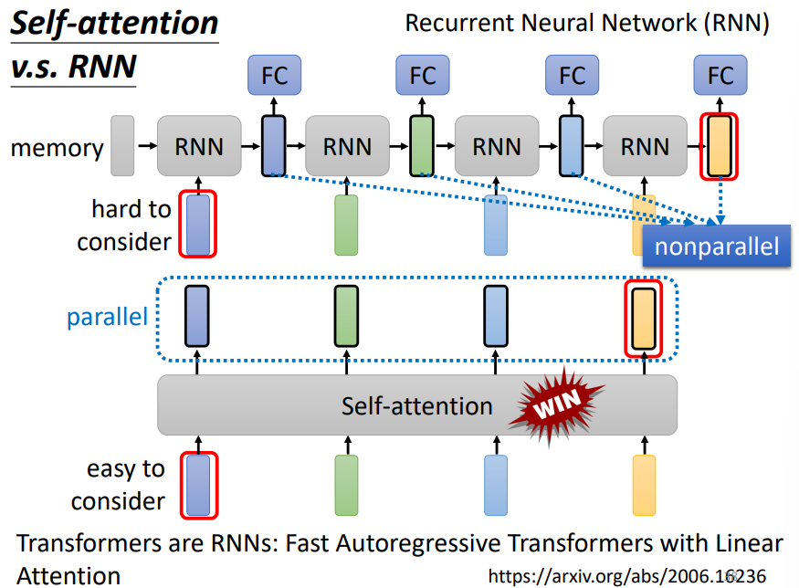

# Transformer
## vector set as input
- one-hot encoding (1-of-N encoding)
- word class
- word embedding
### word embedding
machine learn the meaning of words from reading a lot of documents without supervision
- input: word
- nerual network
  - training data is a lot of text
- output: word embedding

a word can be understood by its **context** -> how to exploit the context?  
#### **Count based** 
基于统计共现，比如LSA(latent semantic analysis)。
先统计词和词之间在语料中的共现次数，形成一个巨大的“词-上下文”矩阵，然后通过降维（如 SVD）得到低维词向量。
- two words $w_i$ and $w_j$ frequently co-occur, $V(w_i)$ and $V(w_j)$ would be close to each other  
- $N_{i,j}$: number of times  $w_i$ and $w_j$ in the same document
-  $V(w_i) \cdot V(w_j)$ and $N_{i,j}$ is very close 

#### **Prediction based** 
通过训练一个模型去预测上下文或预测目标词，在训练过程中学到词的向量表示。如word2vec, GloVe,ELMo/BERT/GPT。

**sharing parameters**

how to make make $w_i$ equal to $w_j$?
- given $w_i$ and $w_j$ the same initialization
- $w_i \leftarrow w_i - \eta \frac{\partial C}{\partial w_i} - \eta \frac{\partial C}{\partial w_j}  $
- $w_j \leftarrow w_j - \eta \frac{\partial C}{\partial w_j} - \eta \frac{\partial C}{\partial w_i}  $

**various architectures**

CBOW: continuous bag of word
- 上下文来预测中心词 

skip-gram
- 中心词预测上下文词

#### multi-domain embedding
- image
- document

## output
1. each vector has a label
    - POS tagging 每个词向量 -> 其词性
    - 语音：每个语音信号对应的音标
    - social network （每个节点是一个vector，有什么特性-如是否买商品）
2. the whole sequence has a label
    - sentiment analysis
    - 语音：机器听一段声音，决定是谁讲的
3. model decides the number of labels itself
    - seq2seq (translation)
    - voice recognization 语音辨识

### sequence labeling
即sequence里的每个向量，都给它一个label
FC: fully-connected 
- 每个向量 -> FC -> output
- consider the context? -> windows to consider the neighbor
- consider the whole sequence? -> **self-attention**

为什么不能用 a window covers the whole sequence?
- sequence长度每个都不一样，除非统计出最长sequence，window取该长度
- 如果开很长的window，意味着FC需要很多参数，运算量大，容易overfitting

## self-attention
李宏毅: [self-attention & transformer](https://www.bilibili.com/video/BV1v3411r78R?spm_id_from=333.788.videopod.episodes&vd_source=c40614f29fe4e0bd8bf156e97f9b3287) 
paper: [Attention is All You Need](https://arxiv.org/pdf/1706.03762)

会考虑整个sequence的信息，然后input几个vector就输出几个vector

如何决定两个向量的关联性？

- $\alpha$: attention score, 哪个$\alpha'$越大，其对应的$\mathbf{v}$会dominate输出结果

矩阵角度： 

### multi-head self-attention
why multi-head? -> different type of relevance
- 多个q，不同q负责不同种类的相关性

### positional encoding
- positional vector $\mathbf{e^i}$ + input $\mathbf{a^i}$

### self-attention v.s CNN/RNN
#### self-attention v.s CNN
CNN: self-attention that can only attends in a receptive field
- CNN is simplified self-attention

self-attention: CNN with learnable receptive field
- self-attention is the complex version of CNN

当数据集较大时，self-attention的效果会超过CNN，数据量小时，self-attention容易overfitting

#### self-attention v.s. RNN
- 远距离依赖的问题
- faster,因为是parallel并行的

