# Transformer
[经典网络架构学习-Transformer](https://blog.csdn.net/BXD1314/article/details/125759352?spm=1001.2014.3001.5502)
## vector set as input
- one-hot encoding (1-of-N encoding)
- word class
- word embedding
### word embedding
李宏毅：[word embedding](https://www.youtube.com/watch?v=X7PH3NuYW0Q)
machine learn the meaning of words from reading a lot of documents without supervision
- input: word
- nerual network
  - training data is a lot of text
- output: word embedding

a word can be understood by its **context** -> how to exploit the context? <br>
#### **Count based**<br>
基于统计共现，比如LSA(latent semantic analysis)。
先统计词和词之间在语料中的共现次数，形成一个巨大的“词-上下文”矩阵，然后通过降维（如 SVD）得到低维词向量。
- two words $w_i$ and $w_j$ frequently co-occur, $V(w_i)$ and $V(w_j)$ would be close to each other <br>
- $N_{i,j}$: number of times  $w_i$ and $w_j$ in the same document
-  $V(w_i) \cdot V(w_j)$ and $N_{i,j}$ is very close<br>

#### **Prediction based**<br>
通过训练一个模型去预测上下文或预测目标词，在训练过程中学到词的向量表示。如word2vec, GloVe,ELMo/BERT/GPT。

**sharing parameters**

how to make make $w_i$ equal to $w_j$?
- given $w_i$ and $w_j$ the same initialization
- $w_i \leftarrow w_i - \eta \frac{\partial C}{\partial w_i} - \eta \frac{\partial C}{\partial w_j}  $
- $w_j \leftarrow w_j - \eta \frac{\partial C}{\partial w_j} - \eta \frac{\partial C}{\partial w_i}  $

**various architectures**

CBOW: continuous bag of word
- 上下文来预测中心词<br>

skip-gram
- 中心词预测上下文词

#### multi-domain embedding
- image
- document

### positional embedding
why? -> transformer不采用RNN结构，而使用全局信息，不能利用单词的顺序信息，但这部分信息对NLP来说非常重要，所以transformer中使用positional embedding保存单词在序列中的相对或绝对位置。<br>
#### Sinusoidal Positional Encoding 正弦位置编码
$PE_{(pos, 2i)} = sin(\frac{pos}{10000^{2i/d}})$ <br>
$PE_{(pos, 2i+1)} = cos(\frac{pos}{10000^{2i/d}})$
- pos: 序列中的位置(0, 1, 2, ...)<br>
- i: index of dimension (0, 1, ..., d-1)
- 偶数维用sin， 奇数维用cos
- $10000^{2i/d}$控制频率，保证不同维度有不同的周期
  - 低维(i小) -> 周期短，变化快 -> 编码局部信息（短程信息）
  - 高维(i大) -> 周期长，变化慢 -> 编码全局信息（长程信息）
- 即使序列比训练时更长，也能计算其位置的编码
- 模型可以计算出相对位置，对于固定长度的间距k，PE(pos+k)可以通过PE(pos)计算得出

#### learnable positional embedding
类似于word embedding，直接为每个位置分配一个向量，随机初始化，随着训练更新<br>
e.g.: BERT, GPT

## output
1. each vector has a label
    - POS tagging 每个词向量 -> 其词性
    - 语音：每个语音信号对应的音标
    - social network （每个节点是一个vector，有什么特性-如是否买商品）
2. the whole sequence has a label
    - sentiment analysis
    - 语音：机器听一段声音，决定是谁讲的
3. model decides the number of labels itself
    - seq2seq (translation)
    - voice recognization 语音辨识

### sequence labeling
即sequence里的每个向量，都给它一个label
FC: fully-connected<br>
- 每个向量 -> FC -> output
- consider the context? -> windows to consider the neighbor
- consider the whole sequence? -> **self-attention**

为什么不能用 a window covers the whole sequence?
- sequence长度每个都不一样，除非统计出最长sequence，window取该长度
- 如果开很长的window，意味着FC需要很多参数，运算量大，容易overfitting

## self-attention
李宏毅B站视频: [self-attention & transformer](https://www.bilibili.com/video/BV1v3411r78R?spm_id_from=333.788.videopod.episodes&vd_source=c40614f29fe4e0bd8bf156e97f9b3287)<br>
[self-attention](https://speech.ee.ntu.edu.tw/~hylee/ml/ml2021-course-data/self_v7.pdf)<br>
[transformer](https://speech.ee.ntu.edu.tw/~hylee/ml/ml2021-course-data/seq2seq_v9.pdf)<br>
paper: [Attention is All You Need](https://arxiv.org/pdf/1706.03762)

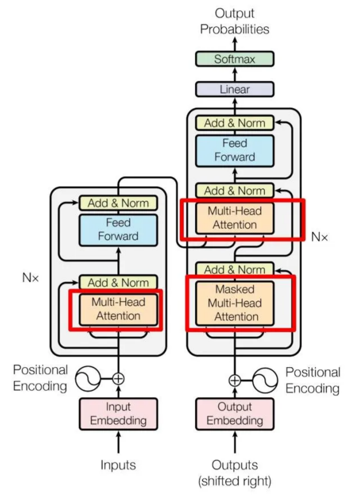

会考虑整个sequence的信息，然后input几个vector就输出几个vector
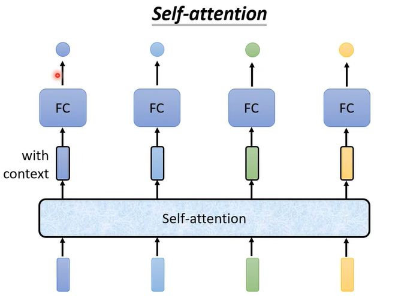
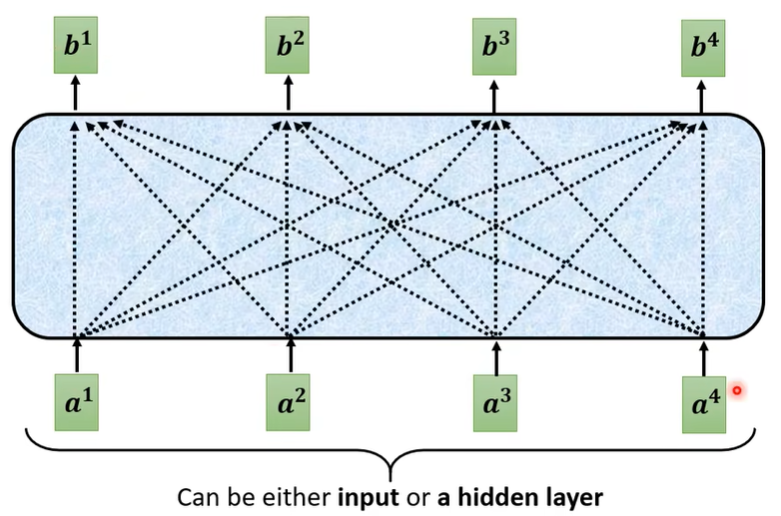

如何决定两个向量的关联性？
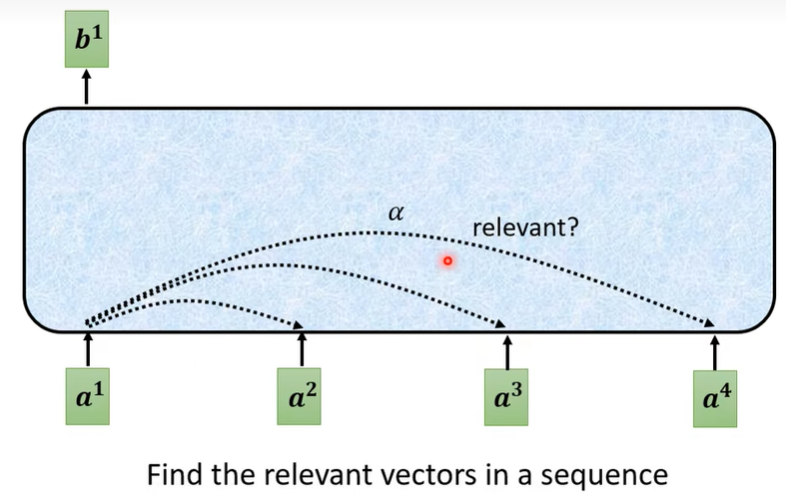
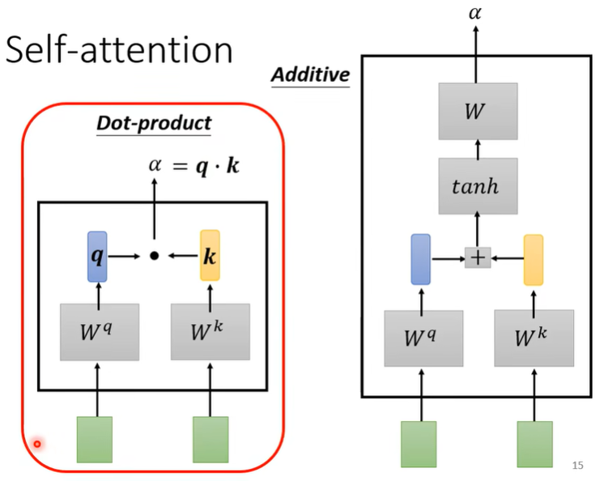
- $\alpha$: attention score, 哪个$\alpha'$越大，其对应的$\mathbf{v}$会dominate输出结果
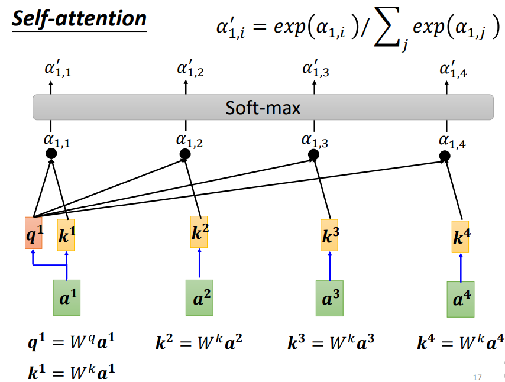
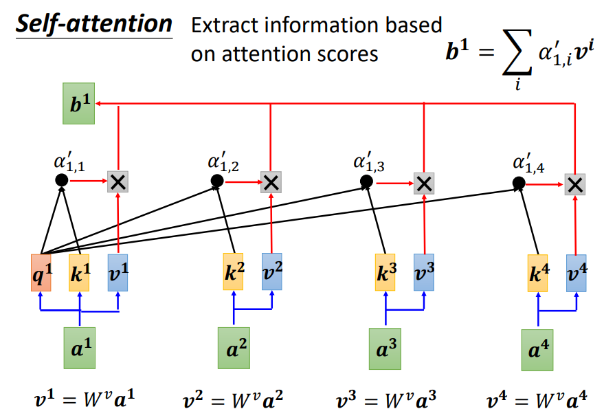

矩阵角度：<br>
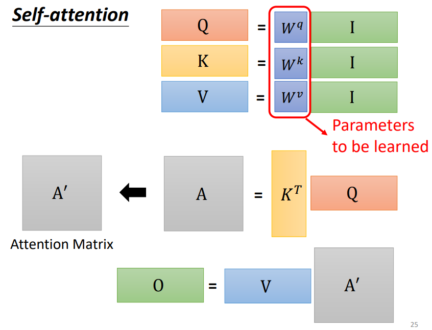
**公式**<br>
$Attention(Q,K,V) = softmax(\frac{QK^T}{\sqrt{d_k}})V$
- $d_k$ normalization
- Q, K decides the distribution of attention (weights)
- V decides the information to pass on (content itself)

<font color = red>为什么要除以$\sqrt{d_k}$?</font><br>

$d_k$为query和key的维度，随着$d_k$增大，$Q \cdot K = \sum_{i=1}^{d_k}q_i k_i$ 的值会变得越来越大，softmax在大数值输入时会变得非常陡峭，导致梯度消失，训练不稳定，因此除以$\sqrt{d_k}$是为了让内积的方差保持在一个合理的范围，这样softmax的输入分布不会随维度大小而爆炸，梯度也比较稳定。


### multi-head self-attention
why multi-head? -> different type of relevance
- 多个q，不同q负责不同种类的相关性

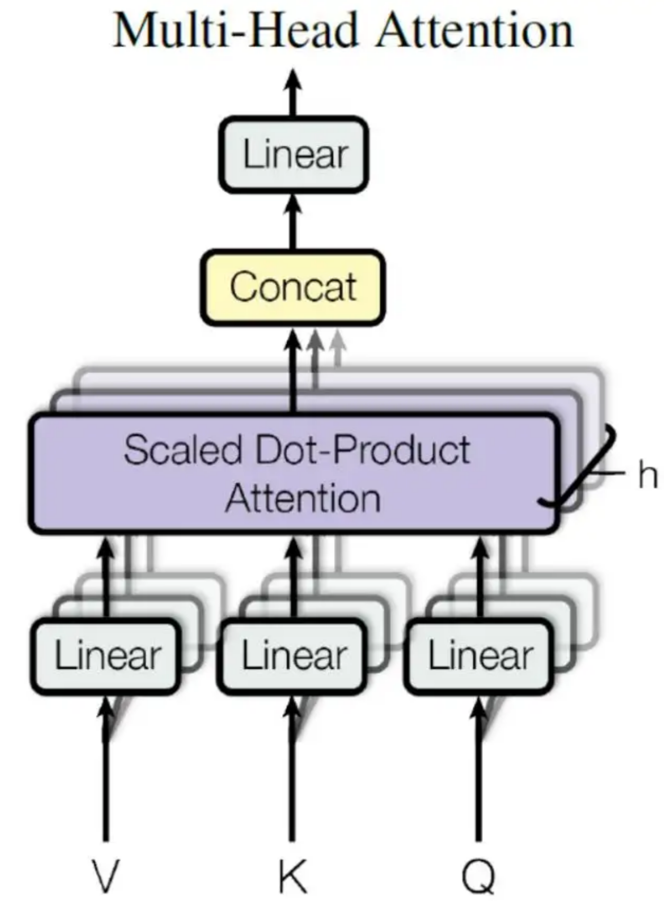
输入$\mathbf{X}$分别传递给h个不同的self-attention中，计算得到h个输出矩阵$\mathbf{Z}$，然后将其concatenate到一起，传入linear层，最终得到输出$\mathbf{Z}$

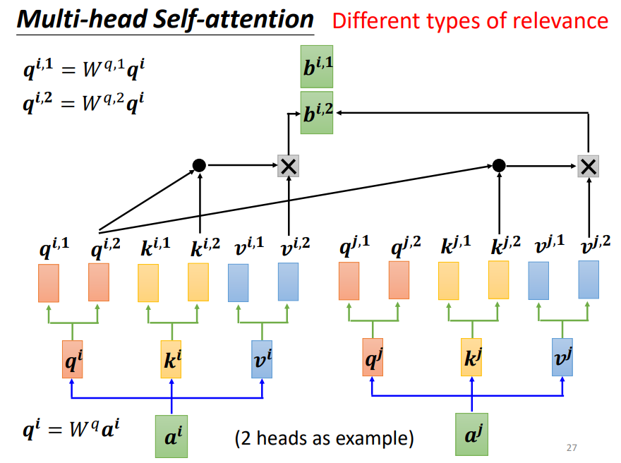

### positional encoding
- positional vector $\mathbf{e^i}$ + input $\mathbf{a^i}$

### self-attention v.s CNN/RNN
#### self-attention v.s CNN
CNN: self-attention that can only attends in a receptive field
- CNN is simplified self-attention

self-attention: CNN with learnable receptive field
- self-attention is the complex version of CNN

当数据集较大时，self-attention的效果会超过CNN，数据量小时，self-attention容易overfitting

#### self-attention v.s. RNN
- 远距离依赖的问题
- faster,因为是parallel并行的

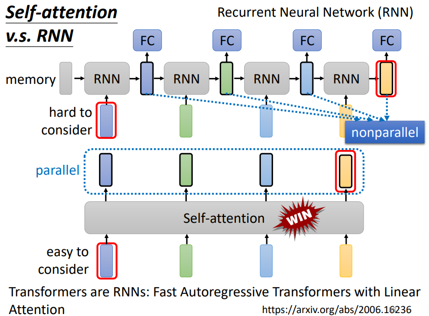

# Encoder
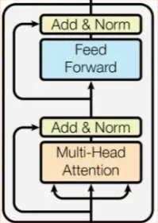
## add & norm
- add: residual connection，输入输出需要一致
- norm: 指layer normalization，通常用于RNN结构

<font color = red>关于Norm拓展</font><br>
1. CNN中`batch norm`与`layer norm`的区别
2. llm中Norm的变种有哪些

## feed forward
2 layers的全连接层，第一层激活函数ReLU，第二层不适用激活函数
1. $ H = ReLU(W_1 X + b_1)$
2. $ O = W_2 H + b_2$

# Decoder
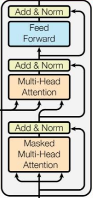
与encoder block的区别：<br>
1. 两个multi-head attention
2. 第一个multi-head attention采用了masked操作
3. 第二个multi-head attention为cross attention，其$\mathbf{K}$, $\mathbf{V}$矩阵使用encoder的编码信息矩阵进行计算，$\mathbf{Q}$使用上一个decoder block的输出计算
4. 最后有softmax计算翻译单词的概率
## 第一个multi-head attention
$Attention(\mathbf{Q}, \mathbf{K}, \mathbf{V}, \mathbf{M}) = softmax(\frac{\mathbf{QK^{\top}}}{\sqrt{d_k}} + \mathbf{M})\mathbf{V}$
- $\mathbf{M}$: 掩码矩阵，在self-attention的softmax之前使用，需要屏蔽的位置为$-\infty$，其余位置为0，通过相加，需要屏蔽的位置为无穷小，softmax后值为0，这样得到的输出矩阵只和之前的信息有关
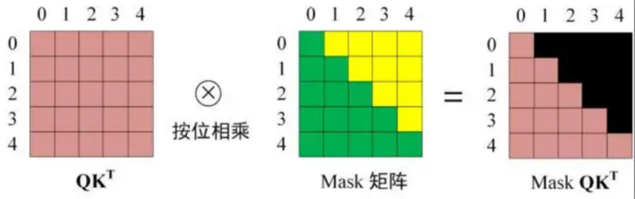

# transformer与各种大模型
## encoder + decoder
### google的T5模型系列
### OFA 通义实验室
- one-for-all通用多模态预训练模型，使用简单的序列到序列的学习框架统一模态（跨模态、视觉、语言等模态）和任务（如图片生成、视觉定位、图片描述、图片分类、文本生成等）
## encoder
### bert
[BERT](../transformer_extend/bert/BERT.md)
### vit
[ViT](../transformer_extend/vit/vit.md)
### clip
[CLIP](../transformer_extend/clip/CLIP.md)

## decoder

### gpt
- learnable positional embedding
- pre-layernorm
- activation: GELU

### Meta: llama
英文语料<br>

三个版本：

| llama |llama1| llama2            |llama3|
|----|----|-------------------|---|
|size| 7B, 13B, 33B, 65B | 3B, 13B, 34B, 70B |8B, 13B, 70B, 400B|
|training corpus| 1.4T <br> 20种语言| 2.0T              | 15T <br> 95%英文，5%其他30+种语言|
|context|2k| 4k                |8K|
|attention| MHA| MQA -> GQA        | GQA|

对比transformer的改动：
1. pre-layernorm: RMS norm
2. positional embedding: after normalization, RoPE
3. self-attention: group query attention
4. FFN activation: SwiGLU

post training 和 reinforcement learning --> 对齐人类偏好，像人类思维一样去表达

并行计算：数据并行化、模型并行化、pipeline并行化<br>
infra很强

### gemma
*google产品：Gemma (open) & Gemini (closed) <br>

模型规模：小型(2B), 中型(7B), 9B

特点：
1. sliding window机制
2. 用了很多RMS Norm, 保证训练过程稳定收敛
   3. input_rms_norm
   4. post_attn_rms_norm
   4. pre_ffn_rms_norm
   5. post_ffn_rms_norm
   6. rms_norm
3. FFN不同：
   4. 通过Gate_proj引入门控机制，决定哪些信息应该被保留或丢弃。 
   5. GeLU激活函数

### qwen 千问
```
           ┌─────────────────────────────┐
           │       大规模语料训练         │
           │     （预测下一个词）         │
           └──────────┬──────────────────┘
                      │
               基座模型（Qwen-Base）
                      │
                      ▼
           ┌─────────────────────────────┐
           │      SFT：监督微调           │
           │   用人工编写指令-回答数据训练 │
           └──────────┬──────────────────┘
                      │
             得到 Qwen-SFT 模型
                      │
                      ▼
           ┌─────────────────────────────┐
           │      RLHF：人类反馈强化学习   │
           │    1. 人类比较回答 → 奖励模型 │
           │    2. 用PPO优化生成策略       │
           └──────────┬──────────────────┘
                      │
                      ▼
              ✅ Qwen-Chat（对话模型）

```