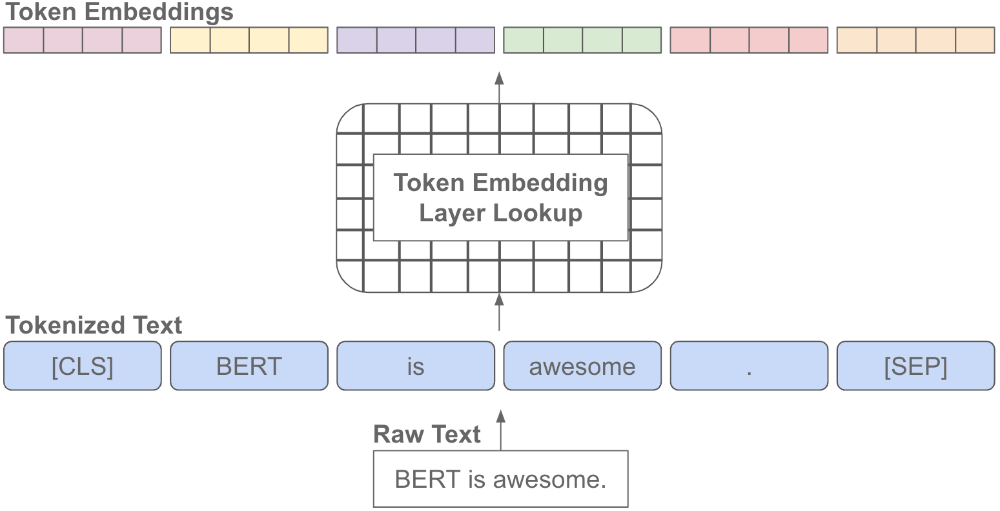

# Bert
paper: [BERT: Pre-training of Deep Bidirectional Transformers for Language Understanding](https://arxiv.org/abs/1810.04805) 
code: [bert](https://github.com/google-research/bert) 
reference resouce: 
- [69 BERT预训练【动手学深度学习v2】](https://www.bilibili.com/video/BV1yU4y1E7Ns/?spm_id_from=333.1391.0.0&p=4&vd_source=c40614f29fe4e0bd8bf156e97f9b3287)
- [BERT 论文逐段精读【论文精读】](https://www.bilibili.com/video/BV1PL411M7eQ/?spm_id_from=333.1391.0.0&vd_source=c40614f29fe4e0bd8bf156e97f9b3287)
- [Language Understanding with BERT](https://cameronrwolfe.substack.com/p/language-understanding-with-bert)

## overview
思路来源于bidirectional + transformer
- ELMo: bidirectional + RNN
- GPT: transformer架构但只能处理单向信息

架构：只有encoder的transformer 

### two version:
|name | blocks | hidden size | heads | params |
|----|----|---|---|---|
|Base|12|768|12|110M|
|Large|24|1024|16|340M|

数据集： >3B 词  

### bert as a box
self-supervised learning 
input: 自然语言 
bert: 黑盒 
output: 对应的语言表征（向量）

拿到语言表征后，通过FC以适应下游任务，如接FC将向量映射到分类任务的维度。

### input
#### 对于Input的修改
1. add segment embedding
2. learnable positional embedding
3. sentence pair as sample: 可以区分不同句子是否为上下文

#### input sequence process

1. tokenization: 将原句子分割为单词
2. inserting special tokens: `[CLS]`-start, `[SEP]`-end
3. embedding

**关于embedding**:
positional embedding: learnable 
segment embedding: 用于区分句子 
word embedding: token的embedding 

## two pre-training tasks
两者是并行训练的 

### masked language model (MLM)

类似于完型填空，MLM每次随机(15%)将一些词元换乘`<mask>` 
这15%的词进一步： 
80% -> mask -> 学上下文 
10% -> 随机替换 -> 学鲁棒性 
10% -> 原词 -> 学真实语义  
该策略让模型训练既接近真实输入，又能处理噪声，解决了预训练与微调真实词不匹配的问题。

**预训练-微调不匹配 pretrain-finetune mismatch** 
预训练阶段主要学习`<mask>`位置的预测任务，可能会过度依赖`<mask>`作为提示
- pretrain: MLM中，输入句子有mask token，用来让模型预测被遮住的词
- fine-tuning: 下游任务中，如分类or回答，输入中不会有mask，模型需要直接处理真实的句子

**MLM: loss** 
MLM的训练目标： 
- 只对被选中的15%位置计算预测误差(CE loss)
- 未被选中的词不会参与损失计算

$\mathcal{L}_{\text{MLM}} = - \sum_{i \in \mathcal{M}} \log P\big(x_i \,\big|\, x_{\backslash \mathcal{M}}\big)$
- $\mathcal{M}$: 被选中进行预测的token集合（15%）
- $x_i$: 第i个token
- $x_{\backslash \mathcal{M}}$: 除$\mathcal{M}$外的上下文token
- $P(x_i|x_{\backslash \mathcal{M}})$: 模型预测token $x_i$的概率

### next sentence prediction (NSP)
预测一个句子对中两个句子是不是相邻 
训练样本中： 
50%概率选择相邻句子对 
50%概率选择随机句子对 

## fine-tuning

1. same architecture as pre-trained model (token embedding, attention, feed-forward), and add output layer according to specific tasks
    - classification (semantic analysis): [CLS] token上接FC+softmax
    - 序列标注任务：在每个token的输出向量上接分类层，输出每个token的标签
    - Q & A: 输出start和end token的概率分布
2. initialize with pre-trained params
2. fine-tuning `all params + new layer` with downstream tasks dataset

## codes
unread