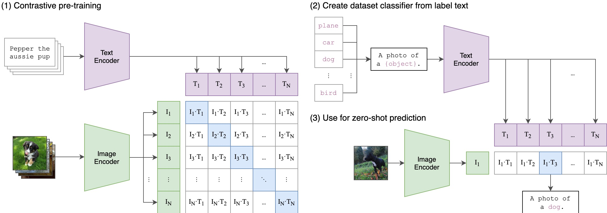
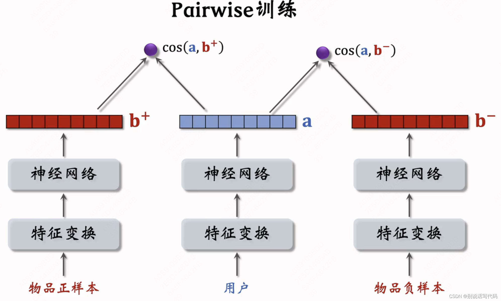
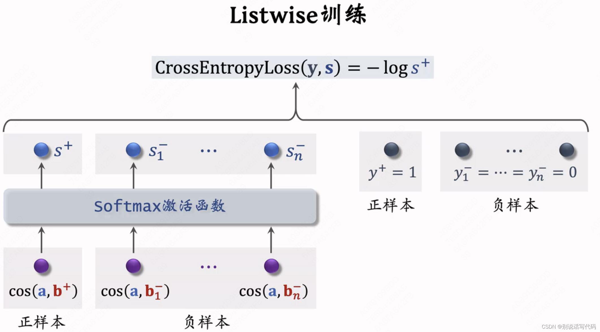

**Table of Content**
- [CLIP](#clip)
  - [architecture](#architecture)
  - [input \& output](#input--output)
    - [input](#input)
    - [output](#output)
  - [loss: infoNCE](#loss-infonce)
    - [calculate steps](#calculate-steps)
- [双塔模型](#双塔模型)
  - [搜索与推荐](#搜索与推荐)
    - [搜索](#搜索)
    - [推荐](#推荐)
  - [训练方式](#训练方式)
    - [pointwise](#pointwise)
    - [pairwise](#pairwise)
    - [listwise](#listwise)
- [Q: Vit \& Clip](#q-vit--clip)
  - [Q1: Vit](#q1-vit)
  - [问题2：训练一个简化版的 CLIP](#问题2训练一个简化版的-clip)

# CLIP
contrastive language-image pretraining<br>
- OpenAI提出，在大量图像和文本数据上进行预训练（大力出奇迹的代表）
- 处理图像和文本之间的相互理解
- 双塔范式，搜索推荐中都很重要

reference:<br>
稀土掘金：[CV大模型系列之：多模态经典之作CLIP，探索图文结合的奥秘](https://juejin.cn/post/7264503343996747830?searchId=20250926120931205C9E75390C39424212)<br>
多模态大模型系列：[多模态大模型 CLIP, BLIP, BLIP2, LLaVA, miniGPT4, InstructBLIP 系列解读](https://zhuanlan.zhihu.com/p/653902791)<br>

codes: [CLIP](https://github.com/openai/CLIP)<br>
[CLIP模型原理与代码实现详解](https://blog.csdn.net/weixin_38252409/article/details/133828294)

contribution:<br>
- 能做到zero-shot: 之前的视觉模型无法泛化新的类别，CLIP能做到无监督训练，迁移能力强
- 大力出奇迹的结果，**4亿**个配对的数据和文本对作为训练集，**batch_size是三万多**，其结果和Resnet在128万个imagenet数据训练后的效果一样。泛化能力很强。
- 开启双塔-多模态（两个transformer并行，一个处理文本，一个处理图像）

## architecture


text encoder: Transformer

image encoder: ResNet-50 or ViT(in paper: ViT-L/14@336px)

## input & output
### input
`<image, text>`对 <br>
- processed image
- text

### output
1. 概率array -> 判断图片是哪个文字的描述，分类模型的应用
2. embedding -> 后续可以作为多模态大模型的输入

## loss: infoNCE
ITC: image-text contrastive loss<br>

训练目标：同pair的$(fea_{img}^{(i)}, fea_{text}^{(i)})$相似度越接近越好，非同pair的$(fea_{img}^{(i)}, fea_{text}^{(j)}, i \neq j)$的相似度越远越好

$\mathcal{L} = \frac{1}{2}(\sum_{i=0}^N CE \frac{exp(fea_{img}^{(i)} \cdot fea_{text}^{(i)})}{\sum_{j=0}^N exp(fea_{img}^{(i)} \cdot fea_{text}^{(j)})} + \sum_{j=0}^N CE \frac{exp(fea_{img}^{(j)} \cdot fea_{text}^{(j)})}{\sum_{j=0}^N exp(fea_{img}^{(j)} \cdot fea_{text}^{(i)})})$

### calculate steps

`<image, text>`对过完各自的encoder后产生对应的向量： <br>
- N条图片向量 $[I_1, I_2, ..., I_N]$
- N条文字向量 $[T_1, T_2, ..., T_N]$

```
I_f = image_encoder(I) #[n, d_i]
T_f = text_encoder(T)  #[n, d_t]
```

向量过一次多模态embedding (multimodal embedding)，提取多模态特征<br>
$W_i, W_t$把文字、图片特征投影到多模态的特征空间，同时对齐两者的dimension。
- $W_i \in R^{d_i \times d_e}$
- $W_t \in R^{d_t \times d_e}$

```
I_e = l2_normalize(np.dot(I_f, W_i), axis=1) # [n, d_e]
T_e = l2_normalize(np.dot(T_f, W_t), axis=1) # [n, d_e]
```

计算图片-文字向量的余弦相似度<br>
- t: learned temperature parameter
```
logits = np.dot(I_e, T_e.T) * np.exp(t)
```

**calculate loss**
```
labels = np.arange(n)
loss_i = cross_entropy_loss(logits, labels, axis = 0)
loss_t = cross_entropy_loss(logits, labels, axis = 1)
loss = (loss_i + loss_t) / 2
```

# 双塔模型
reference: <br>
[推荐系统-双塔模型基本原理与实践](https://zhuanlan.zhihu.com/p/601743047)<br>
[双塔模型模型结构、样本选择、训练方式、线上服务、模型更新](https://blog.csdn.net/qq_21997625/article/details/138394103)

把两个领域的特征编码成一个向量，然后向量相似度进行找回。
- NLP: query和document （微软的DSSM模型）
- 搜索/推荐：query/user 和 item
- 多模态：图像和文字

## 搜索与推荐
### 搜索
人找信息，根据query，在物料候选池中找到相关内容（召回），并进行排序（相关性、排序）

**用户搜索query** -> 特征变化 -> NN -> embedding<br>
**物料候选词** -> 特征变化 -> NN -> embedding

计算两者的余弦相似度

### 推荐
信息找人，将用户兴趣、物料特征同时建模，在物料候选池中找到用户可能感兴趣的内容进行匹配<br>
**用户兴趣**<br>
**物料候选词**

## 训练方式
### pointwise
单个样本建模，每个样本为`(query, item)`，直接预测item和query是否相关，相当于二分类问题<br>
loss: CE loss
### pairwise
[深度学习之三元组损失原理与选取策略](https://blog.csdn.net/zenglaoshi/article/details/106928204)<br>

三元组`<anchor, positive sample, negative sample>`<br>
基本想法：鼓励$cos(a, b^+)$大于$cos(a, b^-)$，且两者之差越大越好，margin为超参数<br>



**Triplet hing loss:** hard magin <br> 
- $cos(a, b^+) > cos(a, b^-) + m$ , loss = 0
- or: loss = $cos(a, b^-) + m - cos(a, b^+)$

$L(a, b^+, b^-) = max(0, cos(a, b^-)+m-cos(a, b^+))$

**Triplet logistic loss:** soft magin<br>

$L(a, b^+, b^-) = log(1 + exp[\sigma(cos(a,b^-)-cos(a, b^+))])$
- $\sigma$: 超参数，控制损失函数的斜率
- 更平滑，能够避免Hinge的梯度消失

### listwise
一条数据包含一个query,一个正样本，多个负样本`<anchor, positive, negative1, negative2, ...>`<br>
基本想法：鼓励$cos(a, b^+)$尽量大，$cos(a, b^-)$尽量小
- softmax输出$n+1$个分数（1正样本，n负样本），正样本最好接近于1，负样本最好接近0，用交叉熵最大化用户与正样本相似度，最小化用户与负样本相似度。
- $\mathcal{L}_{CE}(q, s) = -logs^+$



# Q: Vit & Clip
## Q1: Vit
问题 1：我们正在使用一个 ViT（Vision Transformer）模型来分析一组图片。给定以下参数：
-  图片大小：256x256x3 （宽 x 高 x 颜色通道）
-  Patch 大小：16x16
-  Transformer 的 encoder layers：12
-  Embedding 维度：768
-  MLP（多层感知器）的隐藏层尺寸：3072
-  头的数量（number of heads）在 multi-head self-attention 机制中：12

请计算以下几个问题：
1. 计算每张图片被分割成多少个 patches，并求出每个 patch 的维度。
2. 在 multi-head self-attention 机制中，每个“头”处理的维度是多少？
3. 如果我们想要计算一次前向传播，至少需要多少个权重参数？（假设 bias 和层归一化（layer normalization）参数不计算在内，而且只计算一个 encoder layer 里的参数）

参考答案：<br>
<font color=red>1.计算每张图片被分割成多少个 patches，并求出每个 patch 的维度。</font><br>
答案：256个patches、每个patch为768维
分析过程：依据图片大小信息256x256x3与Patch 大小16x16可以得出，图片在长、宽方向各自被分成16份，共会形成(256/16) x (256/16) = 16 x 16 = 256个patches。

<font color=red>2.在 multi-head self-attention 机制中，每个“头”处理的维度是多少？</font><br>
答案：64
分析过程：每个“头”处理的维度是 数量/头的数量=768/12=64

<font color=red>3.如果我们想要计算一次前向传播，至少需要多少个权重参数？（假设 bias 和层归一化（layer normalization）参数不计算在内，而且只计算一个 encoder layer 里的参数</font><br>

答案：该设定下计算参数总量Self-Attention + MLP = 2359296 + 4718592 = 7077888，如果强调embedding嵌入层也需要计算的话=257*768+4*768*768+2*768*3072=7275264

分析过程 共有3步：<br>
按照题目条件，不考虑bias和norm的参数，一个encoder需要计算self-attention及MLP部分的参数，分别计算并加和处理：
（1）如果要把patchembedding计入的话，输入embedding（256，768）+[cls]( 1, 768 ) = ( 257 , 768 )  共197376参数。
（2）self-attention的模块参数有Q、K、V的权重矩阵Wq、Wk、Wv以及输出权重矩阵Wo，这4个矩阵形状相同，都为[768,768]，所以self-attention的计算参数是 4*768*768=2359296
（3）MLP模块按最原始的transformer架构来看，需要计算两个线性层的参数，一个线性层负责将维度从768映射到3072，权重矩阵参数是[768，3072]。一个线性层将维度从3072映射到768, 权重矩阵参数是[3072，768]。参数计算量总和为2*768*3072=4718592

## 问题2：训练一个简化版的 CLIP 
模型背景:<br>
CLIP (Contrastive Language-Image Pre-training) 是一个多模态视觉和语言模型。它通过联合学习图像和文本的表示，可以在各种视觉和语言任务上进行零样本学习。请你使用PyTorch实现一个简化版本的CLIP模型。

任务:

1. 数据预处理： 创建一个数据预处理流程，可以从数据集中读取图像和对应的文本描述， 并将它们转换成适合模型训练的格式。

2. 模型构建：构建一个简化的 CLIP 模型，该模型应包括两个主要组件：一个用于图像特征提取的 CNN（可以使用预训练模型）和一个用于处理文本输入的 Transformer编码器。 

3. 对比损失函数：实现 CLIP 的对比损失函数。 

4. 训练循环：使用train_loop 函数，在主函数初始化模型、优化器后，实现训练循环。

参考答案（deepseek写的）
```
import torch
import torch.nn as nn
import torch.nn.functional as F
from torchvision import transforms, models
from torch.utils.data import Dataset, DataLoader
from transformers import DistilBertModel, DistilBertTokenizer
import numpy as np
from PIL import Image
import os

# ----------------------
# 1. 数据预处理
# ----------------------
class CLIPDataset(Dataset):
    def __init__(self, image_dir, text_descriptions, image_size=224):
        """
        image_dir: 图像文件夹路径
        text_descriptions: 字典 {image_filename: "text description"}
        """
        self.image_paths = [os.path.join(image_dir, fname) for fname in text_descriptions.keys()]
        self.texts = list(text_descriptions.values())
        
        # 图像预处理
        self.image_transform = transforms.Compose([
            transforms.Resize((image_size, image_size)),
            transforms.ToTensor(),
            transforms.Normalize(mean=[0.485, 0.456, 0.406], 
                               std=[0.229, 0.224, 0.225])
        ])
        
        # 文本tokenizer (使用DistilBERT的tokenizer)
        self.tokenizer = DistilBertTokenizer.from_pretrained('distilbert-base-uncased')
        self.max_seq_len = 77  # CLIP标准长度

    def __len__(self):
        return len(self.image_paths)

    def __getitem__(self, idx):
        # 图像处理
        image = Image.open(self.image_paths[idx]).convert('RGB')
        image = self.image_transform(image)
        
        # 文本处理
        text = self.texts[idx]
        text_input = self.tokenizer(
            text, 
            return_tensors='pt', 
            max_length=self.max_seq_len, 
            padding='max_length', 
            truncation=True
        )
        
        return {
            'image': image,
            'input_ids': text_input['input_ids'].squeeze(0),
            'attention_mask': text_input['attention_mask'].squeeze(0)
        }

# 示例数据
sample_data = {
    "image1.jpg": "a cat sitting on a couch",
    "image2.jpg": "a dog playing in the park",
    "image3.jpg": "a sunset over mountains"
}
dataset = CLIPDataset("path/to/images", sample_data)

# ----------------------
# 2. 模型构建
# ----------------------
class ImageEncoder(nn.Module):
    """简化版图像编码器 (使用ResNet18)"""
    def __init__(self, embed_size=512):
        super().__init__()
        self.cnn = models.resnet18(pretrained=True)
        self.cnn.fc = nn.Linear(self.cnn.fc.in_features, embed_size)
        
    def forward(self, x):
        return F.normalize(self.cnn(x), p=2, dim=-1)

class TextEncoder(nn.Module):
    """简化版文本编码器 (使用DistilBERT)"""
    def __init__(self, embed_size=512):
        super().__init__()
        self.bert = DistilBertModel.from_pretrained('distilbert-base-uncased')
        self.proj = nn.Linear(self.bert.config.hidden_size, embed_size)
        
    def forward(self, input_ids, attention_mask):
        outputs = self.bert(input_ids=input_ids, attention_mask=attention_mask)
        pooled = outputs.last_hidden_state[:, 0, :]  # 取[CLS] token
        return F.normalize(self.proj(pooled), p=2, dim=-1)

class CLIPModel(nn.Module):
    def __init__(self, embed_size=512):
        super().__init__()
        self.image_encoder = ImageEncoder(embed_size)
        self.text_encoder = TextEncoder(embed_size)
        self.logit_scale = nn.Parameter(torch.ones([]) * np.log(1 / 0.07))  # 可学习的温度参数
        
    def forward(self, batch):
        image_features = self.image_encoder(batch['image'])
        text_features = self.text_encoder(
            input_ids=batch['input_ids'],
            attention_mask=batch['attention_mask']
        )
        return image_features, text_features, self.logit_scale.exp()

# ----------------------
# 3. 对比损失函数
# ----------------------
def clip_loss(image_features, text_features, logit_scale):
    # 计算相似度矩阵
    logits_per_image = logit_scale * image_features @ text_features.t()
    logits_per_text = logits_per_image.t()
    
    # 对比损失 (对称的交叉熵)
    labels = torch.arange(len(logits_per_image)).to(logits_per_image.device)
    loss_i = F.cross_entropy(logits_per_image, labels)
    loss_t = F.cross_entropy(logits_per_text, labels)
    return (loss_i + loss_t) / 2

# ----------------------
# 4. 训练循环
# ----------------------
def train_loop(model, dataloader, optimizer, device='cuda', epochs=10):
    model.train()
    model.to(device)
    
    for epoch in range(epochs):
        total_loss = 0.0
        for batch in dataloader:
            # 数据移至设备
            batch = {k: v.to(device) for k, v in batch.items()}
            
            # 前向传播
            image_features, text_features, logit_scale = model(batch)
            
            # 计算损失
            loss = clip_loss(image_features, text_features, logit_scale)
            
            # 反向传播
            optimizer.zero_grad()
            loss.backward()
            optimizer.step()
            
            total_loss += loss.item()
        
        print(f"Epoch {epoch+1}/{epochs}, Loss: {total_loss/len(dataloader):.4f}")

# ----------------------
# 主函数
# ----------------------
if __name__ == "__main__":
    # 初始化
    device = 'cuda' if torch.cuda.is_available() else 'cpu'
    model = CLIPModel(embed_size=512)
    optimizer = torch.optim.AdamW(model.parameters(), lr=5e-5)
    
    # 创建数据加载器
    dataloader = DataLoader(dataset, batch_size=32, shuffle=True)
    
    # 训练
    train_loop(model, dataloader, optimizer, device=device, epochs=10)
```