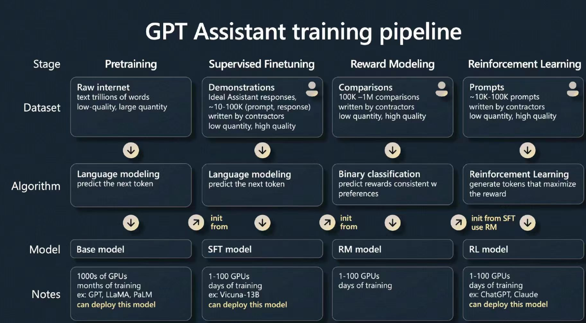
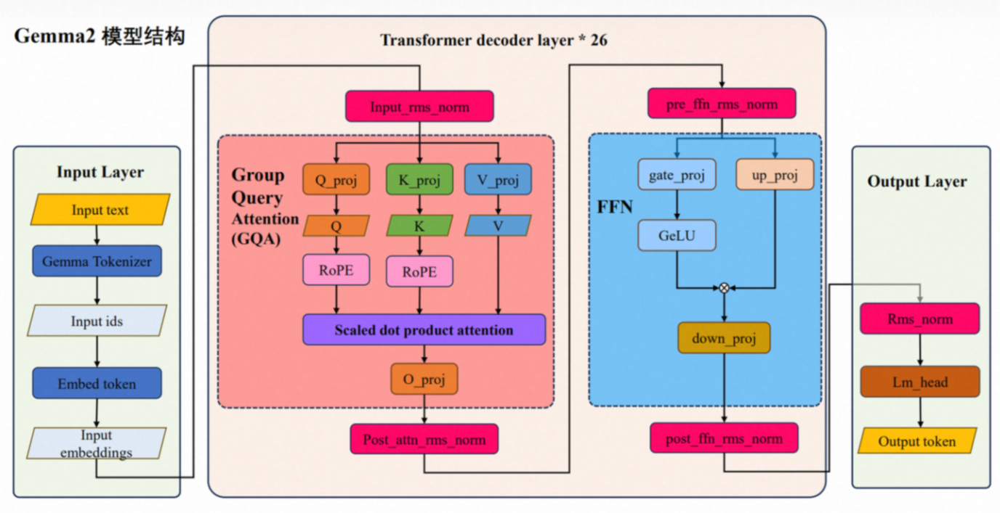

# LLM
## LLM练成流程归纳
### step0: PT pre-training

CPT: continue pretraining

### step1: SFT supervised fine-tuning 
指定任务上的有监督调整，人工标注or能力强的大模型来标注

更好的跟人聊天（情商），和人类偏好对齐

### step2: RM reward model 相当于裁判 
输入为prompt 
modelA answer   
modelB answer  
target：which answer is better and give the reason, classification model

reward mechanism: reward model or reward rule

### step3: RL reinforcement learning
RL reinforce learning   梯度上升累计奖励信号的训练过程
RLHF reinforce learning from human feedback

compared to SFT, **loss** is different
- SFT directly calculate loss, gradient descent
- RL accumulate reward in the process, gradient ascent

### what can we do?
- FT: 对整个模型参数进行微调，适用通用任务，计算资源需求较大。 continue pretraining 作为通用领域和垂直领域的衔接
- SFT: 对整个模型参数进行微调，在有明确标签数据的基础上进行微调。适合具体有监督任务。
- PEFT(parameter-efficient fine-tuning) 高效微调:只微调模型的一小部分参数，节省资源，适用于计算资源有限的场景。LoRA

# decoder-only
## summary of variation
|                                               | transformer |variation| significance |
|-----------------------------------------------|-------|---------|---------|
| [positional embedding](../relatedNotes/PE.md) | 正弦绝对位置编码 | 相对位置编码  - rope  - alibi |更好适应长文本，外推性，远程衰减|
| [norm](../relatedNotes/Normalization.md)      | layer norm| rms norm | 稳定性更好   计算更高效|
| attention                                     | multi-head attention | MHA, MQA, GQA, MLA | 减少运算量，降低复杂度 |
| [FFN的激活函数](../relatedNotes/activation.md)     |ReLU |SwiGlu, GeGlu |更好的映射，表达空间更丰富   加门控，选择性传达信息 |

## gpt
### gpt-2 v.s transformer
- 仅使用解码器结构，专注于生成任务，不需要encoder的双向上下文建模
- 大规模模型：显著增加layers, hidden dimension, heads, 因此增加了模型的表示能力
- 大规模无监督训练：专注于单向自回归语言建模，更适合自然语言生成
- positional embedding: learnable
- layerNorm位置的调整：pre-layerNorm,增强梯度稳定性
- FFN：激活函数GELU    
- 上下文序列长度：1024 （transformer: 512）
- 训练策略：混合精度训练 mixed-precision training 和动态学习率调度

 ## llama
Meta AI 发布

### llama v.s. transformer
- layerNorm -> RMSNorm (Root Mean Square Layer Normalization)
- activation: SwiGLU
- positional embedding: RoPE

### llama 3
#### info
- size: 8B, 13B, 70B, 405B
- corpus: 15T (95% English, 5% other 30+ languages)
- context windows: 128K tokens
- attentions: group query attention
- design choice: 
  - pre-training
  - supervised finetuning
  - rejection sampling
  - direct preference optimization

#### model architecture
transformer decoder - dense

modifications compared to llama 2:
- grouped query attention
- attention mask
- vocabulary: 128K tokens
- RoPE: base frequency hyperparameter to 500,000 -> better context window lengths up to 32K

#### scaling laws
给定计算预算（FLOPs）下，找到该预算内最“划算”的模型规模$\mathbf{N}$（参数量） 和
训练数据规模$\mathbf{D}$（见到的总token数），以使最终validation loss最低。

通过训练许多不同N, D的模型并固定FLOPs，观测哪些组合在相同FLOPs下给出最低损失。 
结果 -> 等FLOPs下最优点“拟合幂律关系(power law)” 

##### Chinchilla / compute-optimal
$$
\text{N}_{opt} \propto \text{C}^a, \text{D}_{opt} \propto \text{C}^b
$$
- $a \approx 0.49$
- $b \approx 0.51$
- trade-off between training tokens and bigger network(parameters)
---
validation loss: negative log-likelihood on downstream tasks

llama 3的实验结论： 402B parameter model on 16.55T tokens
-> 当FLOPs增加的时候，IsoFLOPs curves become flatter around the minimum, 所以最后选了405B的模型，相当于token适当减小，模型适当放大，而loss变化不大

#### 并行计算
3D并行
- DP: 数据并行化
- TP: 模型并行化
- PP: pipeline并行化

llama 1/2 : A100 (Meta's AI Research SuperCluster)  
llama 3: H100 (Meta's production clusters)

16K H100 GPUs

AI cluster: 24K GPUs

## Gemma
1. google: Gemma v.s Gemini

| feature    | Gemma                                 | Gemini                                          |
|------------|---------------------------------------|-------------------------------------------------|
| issue      | 2024初                                 | 2023底                                           |
| 定位         | open source, light-weight,            | closed, multimode                               |
| model size | 2B, 7B                                | 超大规模（数千亿参数）                                     |
| 模态支持       | main text                             | multimode: text, image, sound, video...         |
| users      | researchers and developers            | commercial and enterprise                       |
| tasks      | text generation, q&a, code generation | multimode tasks, complex commercial application |

2. development

| 时间                    | 版本       | 规模  特点                                                                |
| --------------------- |----------|---------------------------------------------------------------------------- |
| **2024 年 2 月** – 首次推出 | Gemma 1  | 初代 “开放轻量”模型，Google 宣布 2 B 与 7 B 参数规模。                       |
| **2024 年 6 月**        | Gemma 2  | 扩大规模／功能、更多变体。                                            |
| **2025 年 3 月**        | Gemma 3  | 最新一代，支持多模态、超长上下文（最多 128K token）、多语言（140+ 语言）等。|
| **2025 年稍晚**          | Gemma 3n | 针对移动／边缘设备优化的 “on-device” 模型版本。)                                 |

### architecture

### attention
#### sliding windows
sliding windows: 模型在计算每个 token 的注意力时，不再看整个上下文，而是只看"最近的一部分token"，
这部分范围就叫做一个sliding window（滑动窗口）。
- gamma 2/3
- calculate complex: $O(N^2)$ -> $O(N \times W)$
- 显存开销：$N^2$ -> $N \times W$
- 能够扩展到非常长的上下文

gamma 3: sliding windows + kv cache

| 模块                  | 机制                                    | 功能         |
| ------------------- | ------------------------------------- | ---------- |
| **Attention Layer** | 局部窗口注意力 (local sliding window)        | 只在窗口内计算注意力 |
| **跨窗口连接**           | 使用 “summary tokens” 或 “global tokens” | 让模型保留跨段语义  |
| **缓存机制**            | KV cache 复用 + 滑动更新                    | 推理时连续窗口滚动  |

#### GQA + RoPE
在group query attention中，使用了旋转位置嵌入来处理位置信息。RoPE将位置信息编码到query和key向量中。

### RMSNorm
用了很多RMSNorm
- input_rms_norm
- post_attn_rms_norm
- pre_ffn_rms_norm
- post_ffn_rms_norm
- rms_norm (output layers)

### Gated-FFN
$$
\text{FFN}(x) = \text{W}_2((\sigma(\text{W}_{gate}x)) \odot (\text{W}_{up}x))
$$

- $\text{W}_{gate}$: 生成门控信号，决定信息本体的哪些部分能通过
- $\text{W}_{up}$: 生成候选激活
- $\sigma$: 非线形激活函数

SwiGLU表达：
$$
\text{SwiGLU}(x) = (x\text{W}_1) \odot \text{Swish}(x\text{W}_2)
$$

$$
\text{FFN}(x) = (x\text{W}_1) \odot \text{Swish}(x\text{W}_2) \text{W}_3
$$

## Qwen
### Qwen v.s. transformer
| feature    | transformer | qwen                  |
|------------|-------------|-----------------------|
| attention  | MHA         | GQA                   |
| 上下文处理      | 固定，短        | DCA+YARN: 128K tokens |
| activation | GeLU/ReLU   | SwiGLU                |
| norm       | layerNorm   | RMSNorm               |
| MoE        | NO          | MoE architecture      |
### development
qwen 2 -> 效率革命，GQA+RoPE
qwen 3 -> 更长上下文，MoE

### DCA: dual chunk attention
分块 + 双通路交互机制

把输入序列按长度划分成多个chunk，定义两种注意力路径，这两条路径在模型层内部同时存在，交替融合。

| 类型                           | 含义              | 作用           |
| ---------------------------- | --------------- | ------------ |
| **Local Attention（局部块内注意力）** | 每个块内部 token 自注意 | 捕获局部语义、减少计算量 |
| **Global Attention（跨块注意力）**  | 每个块的摘要与其他块交互    | 维持全局一致性、长程依赖 |

- calculate complex: $O(n^2)$ -> $O(n)$ / $O(n\log n)$

### YARN
- 动态重标：训练阶段对位置编码的波长进行动态调整，使其适应更长的上下文窗口
- 损失函数约束：通过额外的损失项，强制模型在扩展后的位置编码下保持稳定的注意力分布
- 渐进式扩展：从小窗口开始训练，逐步增加序列长度，避免突然的长度跳跃导致模型崩溃

$$
\text{RoPE}_{YARN}(x, m) = \text{RoPE}(x, \lambda(m)\cdot m)
$$
- $\lambda(m)$: 动态缩放因子，可以控制外推or内插
