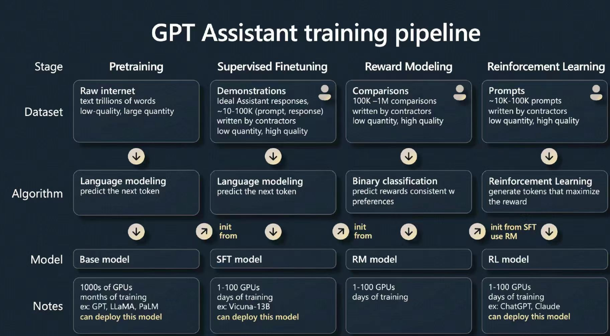

# LLM
## LLM练成流程归纳
step0: PT pre-training

CPT: continue pretraining

step1: SFT supervised fine-tuning 指定任务上的有监督调整，人工标注or能力强的大模型来标注

更好的跟人聊天（情商），和人类偏好对齐

step2: RM reward model 相当于裁判 
输入为prompt 
modelA answer   
modelB answer  
target：which answer is better and give the reason, classification model

reward mechanism: reward model or reward rule

step3: 
RL reinforce learning   梯度上升累计奖励信号的训练过程
RLHF reinforce learning from human feedback

compared to SFT, **loss** is different
- SFT directly calculate loss, gradient descent
- RL accumulate reward in the process, gradient ascent

### what can we do?
- FT: 对整个模型参数进行微调，适用通用任务，计算资源需求较大。 continue pretraining 作为通用领域和垂直领域的衔接
- SFT: 对整个模型参数进行微调，在有明确标签数据的基础上进行微调。适合具体有监督任务。
- PEFT(parameter-efficient fine-tuning) 高效微调:只微调模型的一小部分参数，节省资源，适用于计算资源有限的场景。LoRA
- 
- 

