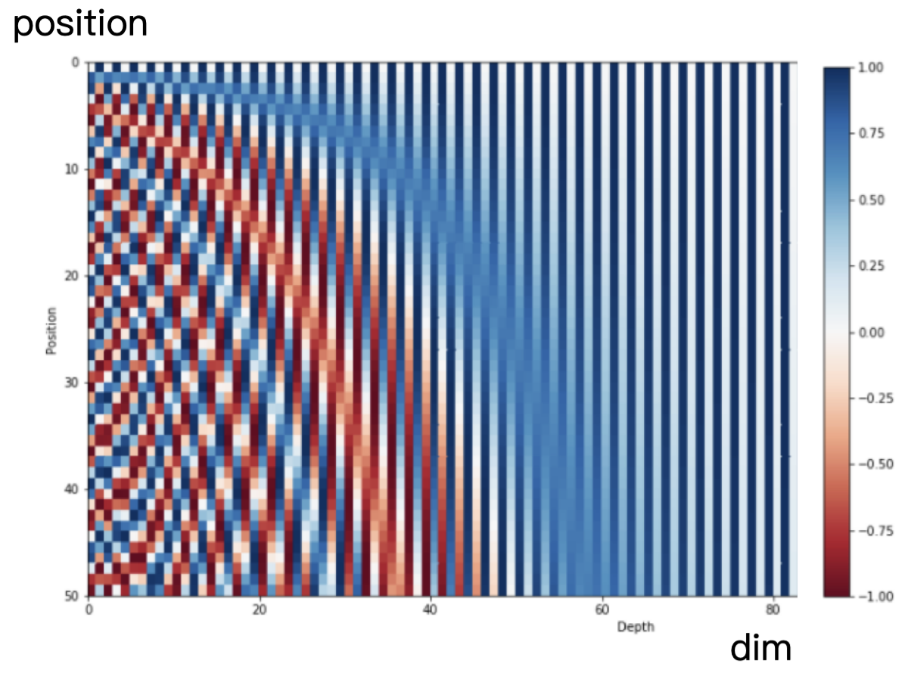

# positional embedding

[深度探讨大模型位置编码及其外推性](https://wjn1996.blog.csdn.net/article/details/131753251?spm=ata.21736010.0.0.39f731ceLG4ik0)

大模型的外推性：让模型在推理阶段可以支持远远超过训练时的长度。（训练通常为4096长度，推理时32K）
- 寻找设计合适的位置编码
- 设计局部注意力机制

## 绝对位置编码

### Sinusoidal Positional Encoding 正弦位置编码
**transformer**

#### formula
$PE_{(pos, 2i)} = sin(\frac{pos}{10000^{2i/d}})$  
$PE_{(pos, 2i+1)} = cos(\frac{pos}{10000^{2i/d}})$
- pos: 序列中的位置(0, 1, 2, ...) 
- i: index of model dimension (0, 1, ..., d-1)
- d: model dimension (e.g.:512, 768)
- 偶数维用sin， 奇数维用cos

#### visualization

row: position vector 固定position在不同维度的编码 
col: 可以看出同一维度在不同position上的周期变化
- $10000^{2i/d}$控制频率，保证不同维度有不同的周期
  - 低维(i小) -> 周期短，变化快 -> 编码局部信息（短程信息）
  - 高维(i大) -> 周期长，变化慢 -> 编码全局信息（长程信息）
- 即使序列比训练时更长，也能计算其位置的编码
- 模型可以计算出相对位置，对于固定长度的间距k，PE(pos+k)可以通过PE(pos)计算得出

#### 输入表征
token表征和对应的positional embedding直接相加

## 相对位置编码
第m和第n个位置的token，相对位置表达为$r = clip(m-n, r_{min}, r_{max})$
- 两个token之间的相对位置，由最大值最小值约束
- 相对位置只需要$r_{max}-r_{min}+1$个表征向量即可
- 只需要有限个相对位置就可以表达出任意长度的相对位置

### RoPE
[你还不懂旋转位置编码吗？](https://www.bilibili.com/video/BV1F1421B7iv/?spm_id_from=333.788.top_right_bar_window_history.content.click&vd_source=c40614f29fe4e0bd8bf156e97f9b3287)
rotary position embedding: 通过绝对位置编码的方式实现相对位置编码

#### 旋转矩阵
二维旋转矩阵：
$$
R(\theta) =
\begin{bmatrix}
\cos\theta & -\sin\theta \\
\sin\theta & \cos\theta
\end{bmatrix}
$$

- $R(\theta_1)R(\theta_2) = R(\theta_1 + \theta_2)$
- $R(\theta)^{\top} = R(-\theta)$
