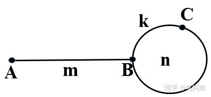

# 链表
链表的增删时间复杂度都是`O(1)`，其长度可以是不固定的，可以动态增删，适合数据量不固定，频繁增删，较少查询的场景。

## 链表的类型
### 单链表
每个节点由两部分组成：<br>
- data
- next 指针域：存放指向下一个节点的指针

```python
class ListNode:
    def __init__(self, data):
        self.data = data
        self.next = None
```
最后一个节点指针域指向null（空指针）

### 双链表
每个节点有两个指针域，一个指向下一个节点，一个指向上一个节点

```python
class DNode:
    def __init__(self, data):
        self.data = data
        self.prev = None
        self.next = None
```
### 循环链表
链表首位相连  -> 解决约瑟夫环Josephus问题


## 链表相交
[160.相交链表](https://leetcode.cn/problems/intersection-of-two-linked-lists/description/?envType=study-plan-v2&envId=top-100-liked)
### 思路1
1. 求出两个链表的长度
2. 求出两个链表的长度的差值，然后让长的链表指针curA直接移动到差值处，这样可以保证两个链表末尾对齐
3. 比较两个链表指针是否相同，如果不相同，同时向后移动，curA == curB时即交点

```python
# 求链表的长度
class ListNode:
    def __init__(self, x):
        self.val = x
        self.next = None

def get_length(self, head:ListNode) -> int:
    length = 0
    while head:
        length += 1
        head = head.next
    return length
```
### 思路2
假设链表a的长度： a + c <br>
假设链表b的长度： b + c <br>
两个链表指针同时从头结点开始走，走完后切换到另一条链表的头部，由于两者走过的长度都为 `a+b+c`，
如果存在交点，两者在第二次遍历时会同时到达交点
如果不存在，都会最终指向`None`，同时退出循环
```python
class Solution:
    def getIntersectionNode(self, headA, headB):
        if not headA or not headB:
            return None
        
        # initialise head pointer
        pointerA = headA
        pointerB = headB
        
        # iteration until pointerA == pointerB
        while pointerA != pointerB:
            pointerA = pointerA.next if pointerA else headB
            pointerB = pointerB.next if pointerB else headA
        
        # if intersection, return pointer, else None
        return pointerA
```
## 反转链表
[206.反转链表](https://leetcode.cn/problems/reverse-linked-list/?envType=study-plan-v2&envId=top-100-liked)

通过修改链表的next指针的指向，直接将链表反转

| 指针    | 含义          | 指向                      |
| ----- | ------------- | ------------------------- |
| `cur` | 当前正在处理的节点     | head（即第一个节点）              |
| `pre` | 反转后链表的“前一个节点” | 初始为 None，因为第一个节点会变成新链表的尾部 |

1. 定义cur指针，指向头结点 cur = head
2. 定义pre指针，初始化为null
3. 反转过程：
   4. cur.next 节点用tmp指针保存  tmp = cur.next 以防止丢失后续链表
   5. cur.next 指向pre   cur.next = pre 当前节点的"next"指针反向，指向前一个节点
   6. 移动两个指针：pre和cur都往下一个节点移动，继续反转 pre = cur, cur = tmp
4. cur指针指向null，循环结束  cur == None
5. 最终返回反转后的链表头 return pre

### 回文链表
链表从前往后读、从后往前读都是一样的。 like string 'level', 'madam'

#### 思路1：节点值复制到数组
1. 遍历链表，把节点值保存到一个数组里
2. 判断数组是否等于它的反转

缺点：需要`O(n)`的额外空间（数组）

```python
def isPalindrome(self, head) -> bool:
    vals = []
    cur = head
    while cur:
        vals.append(cur.val)
        cur = cur.next
    return vals == vals[::-1]
```

#### 思路2：反转后半部分链表
1. 快慢指针找到链表的中点 -> 慢指针每次走一步，快指针每次走两步，所以快指针走完，慢指针走了一半，中点为slow
2. 从中点开始，反转后半部分链表  pre, cur = None, slow
3. 从头和反转后的中点分别遍历对比 left, right = head, pre(反转后的头节点)
4. 判断是否完全相等 left.val == right.val

time complexity: `O(n)`
space complexity: `O(1)`
#### 思路3：递归

## 环形链表
[141.环形链表](https://leetcode.cn/problems/linked-list-cycle/description/?envType=study-plan-v2&envId=top-100-liked) <br>
[142.环形链表II](https://leetcode.cn/problems/linked-list-cycle-ii/description/)

### Floyd判圈算法 （龟兔赛跑算法）
[Floyd判圈法(Floyd Cycle Detection Algorithm)](https://blog.csdn.net/yueguangmuyu/article/details/110367691)

基本思想：快慢指针。A速度快，B速度慢，若是存在环，A和B总是会相遇的，相遇时A所经过的路径长度要比B多若干个环的长度。


- 是否有环：快慢指针
- 环的长度：指针p1固定在相遇位置C，移动指针p2，每次移动1个长度，并用变量`cnt`计数。当p2再次与p1相遇时，此时`cnt`就是环的长度。
- 环的起点：即图中的B，将指针p1指向链表的起始位置A，指针p2仍在位置C，指针p1和p2每次均移动一个单位，p1和p2再次相遇的位置就是环的起点位置B。

### 其他方法
集合法：用集合记录访问过的节点
- 每访问一个节点，把该节点对象存入集合 `visited`
- 后续遍历时，再次遇到已经访问过的节点，说明链表中存在环，且该节点就是环的入口点

## 合并两个有序链表
[21.合并两个有序链表](https://leetcode.cn/problems/merge-two-sorted-lists/?envType=study-plan-v2&envId=top-100-liked)

### 双指针 + 比较大小依次接入
1. 同时遍历两个链表
2. 每次比较当前两个节点的值，并将较小的值的节点接到新链表后面
3. 向前移动被取节点的链表的指针
4. 直到有一个链表遍历完 while l1 and l2
5. 把另一个链表剩下的部分接到新链表
6. 最终返回的时dummy.next 而不是cur，cur是当前构造到哪里，会一直往后移动

